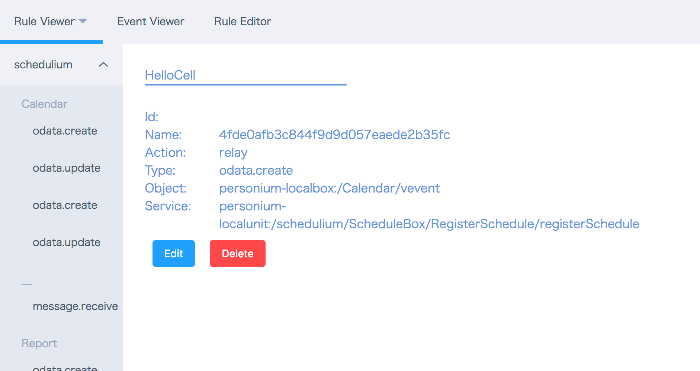
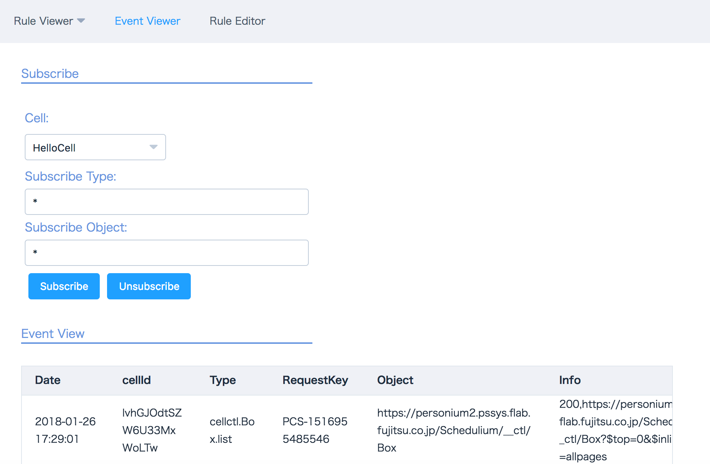

# Rule-Event-Viewer

Personium@1.6系専用　
Rule/Eventの管理マネージャ

## How to use

```
cp config.sample.js config.js
vi config.js
npm i
npm run build
open index.html

```

## Image

#### Rule Viewer


#### Event Viewer

